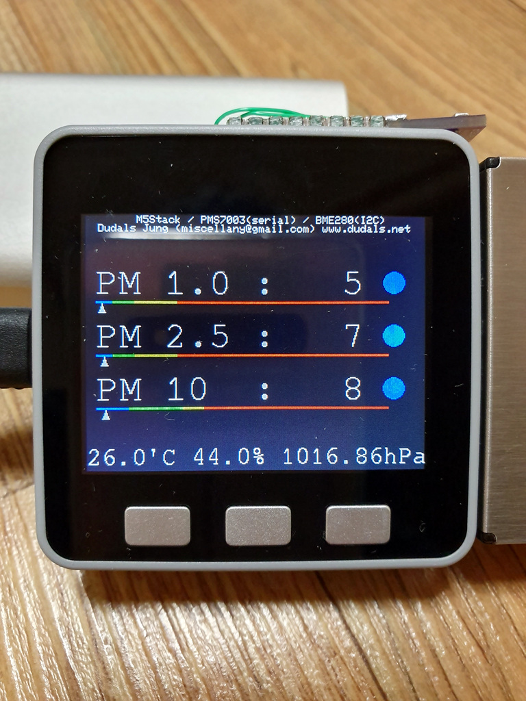
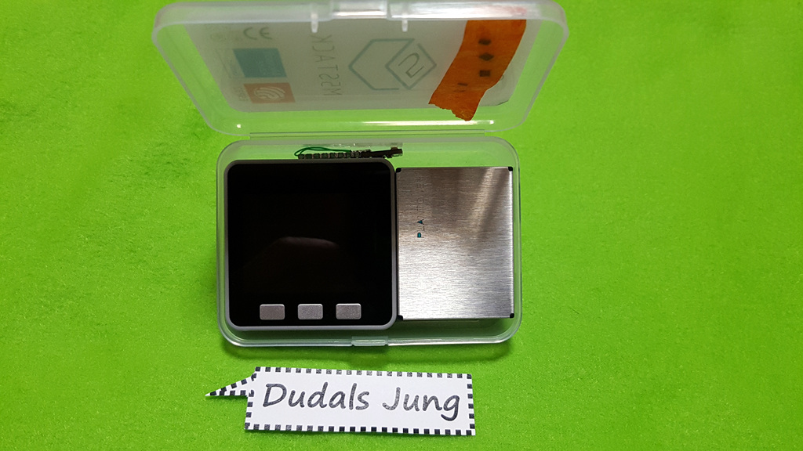
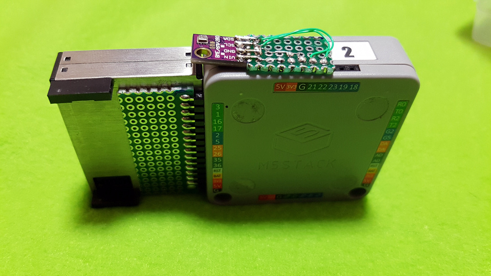
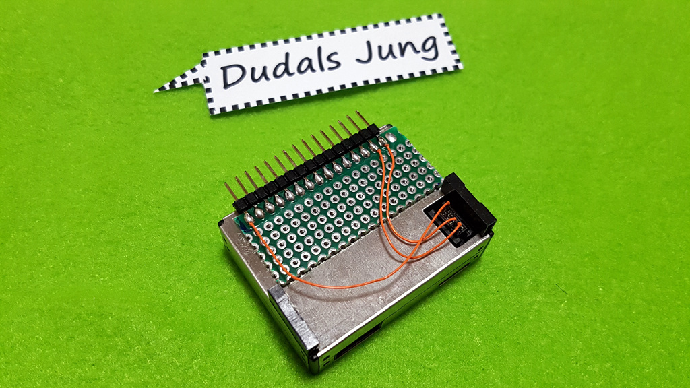
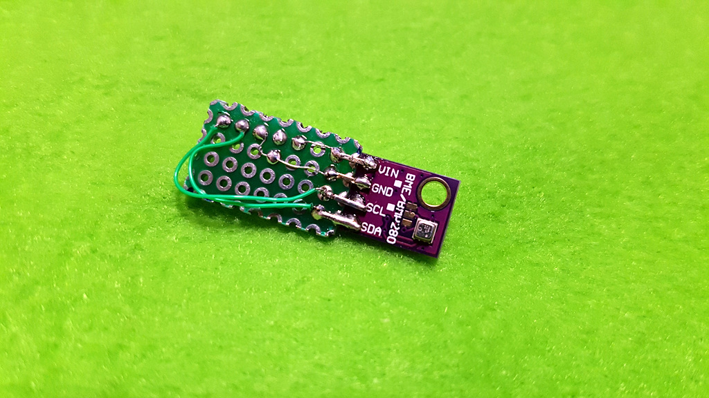
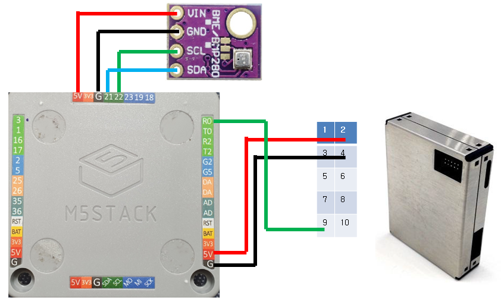

* About
  * 2019/03/15
  * Dudals Jung
  * miscellany@gmail.com
  * www.dudals.net

* Hardware
  * M5Stack
  * PMS7003 - Serial
  * BME280 - I2C1

* Development tools
  * Arduino 1.8.8
  * (Add BlueDot_BME280 Library)

* Spec  
  * M5Stack is a small module with CPU, LCD, battery, Wifi, Bluetooth, GPIO. 
  * PMS7003 is a fine dust sensor.
  * BME280 is temperature, humidity, air pressure, and altitude sensor.

* I made a portable device with this.
  * I put these in the M5Stack box.
  * This is perfectly sized.

* It works with 3 tasks.
  * task 1 : PMS7003 Serial Data collection
  * task 2 : BME280 I2C Data collection
  * task 3 : Display Data

* The fine dust measurement standard is Korean standard.
* I don't have smd parts in home, so no pull up, no pull down.
  * if you have parts, you can apply them.
* I have not yet machined a hole in the case.

* if you want Save to SD Card, WIFI transmit.... Yes, You can do it.

* Checksum checking of data received from PMS7003 is not implemented
  * PMS7003 Data size is Fiexed 32 byte.

